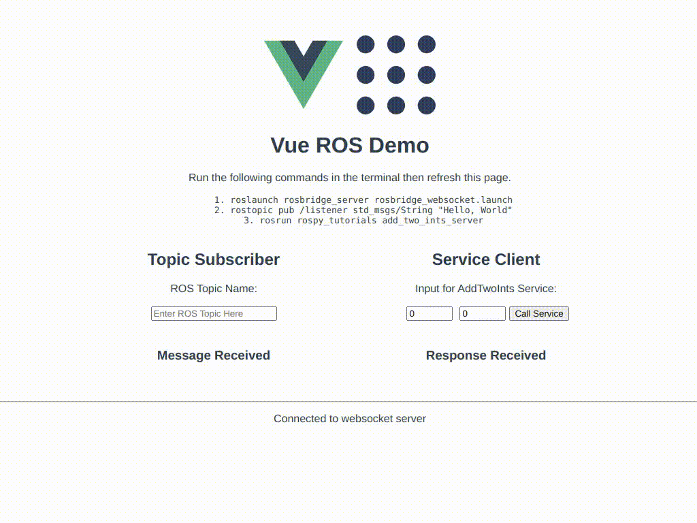

# vue-ros-demo
Simple Demonstration of Vue + ROS Integration

## Demonstration
<p align="center">
    
    </br>
    <sup>Demonstration (As seen in Chrome)</sup>
</p>

## Dependencies
* Vue v3
* roslib v1.3.0
* ROS 
    * It should be compatible with ROS 1 and 2. Please open an issue if not.

## Prerequisite
Make sure to run the following commands in the terminal
```console
roslaunch rosbridge_server rosbridge_websocket.launch
rostopic pub /listener std_msgs/String "Hello, World"
rosrun rospy_tutorials add_two_ints_server
```

## Installation
```console
npm install
```
Incase of the folllowing error, please execute `npm install --force`
```console
npm ERR! code ERESOLVE
npm ERR! ERESOLVE unable to resolve dependency tree
npm ERR! 
npm ERR! While resolving: vue-ros-demo@0.1.0
npm ERR! Found: eslint-plugin-vue@8.7.1
npm ERR! node_modules/eslint-plugin-vue
npm ERR!   dev eslint-plugin-vue@"^8.0.3" from the root project
npm ERR! 
npm ERR! Could not resolve dependency:
npm ERR! peer eslint-plugin-vue@"^7.0.0" from @vue/eslint-config-standard@6.1.0
npm ERR! node_modules/@vue/eslint-config-standard
npm ERR!   dev @vue/eslint-config-standard@"^6.1.0" from the root project
npm ERR! 
npm ERR! Fix the upstream dependency conflict, or retry
npm ERR! this command with --force, or --legacy-peer-deps
npm ERR! to accept an incorrect (and potentially broken) dependency resolution.
npm ERR! 
npm ERR! See /home/ravi/.npm/eresolve-report.txt for a full report.

npm ERR! A complete log of this run can be found in:
npm ERR!     /home/ravi/.npm/_logs/2022-08-15T10_52_32_924Z-debug-0.log
```

## Run (for development)
```console
npm run serve
```

## Linting
```console
npm run lint
```

## Compile (for production)
```console
npm run build
```

## Note
The project has been tested with the following npm packages:

```console
$ npm list
vue-ros-demo@0.1.0 /home/ravi/vue-ros-demo
├── @babel/core@7.18.10
├── @babel/eslint-parser@7.18.9
├── @vue/cli-plugin-babel@5.0.8
├── @vue/cli-plugin-eslint@5.0.8
├── @vue/cli-service@5.0.8
├── @vue/eslint-config-standard@6.1.0
├── core-js@3.24.1
├── eslint-plugin-import@2.26.0
├── eslint-plugin-node@11.1.0
├── eslint-plugin-promise@5.2.0
├── eslint-plugin-vue@8.7.1
├── eslint@7.32.0
├── roslib@1.3.0
└── vue@3.2.37
```
